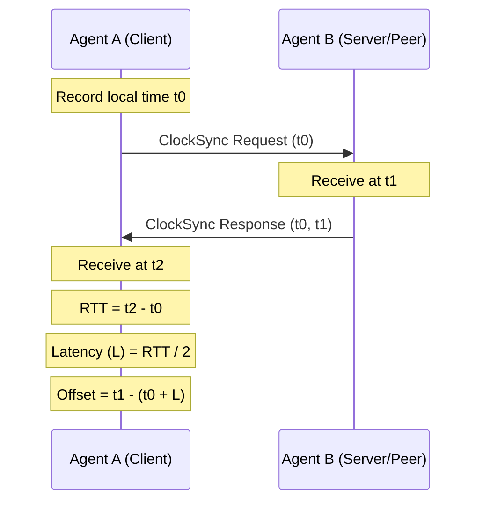
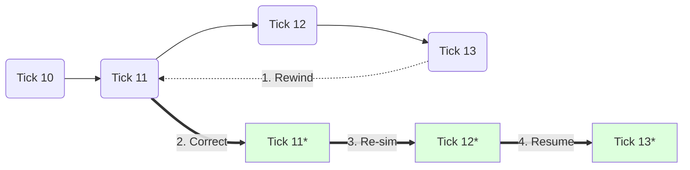
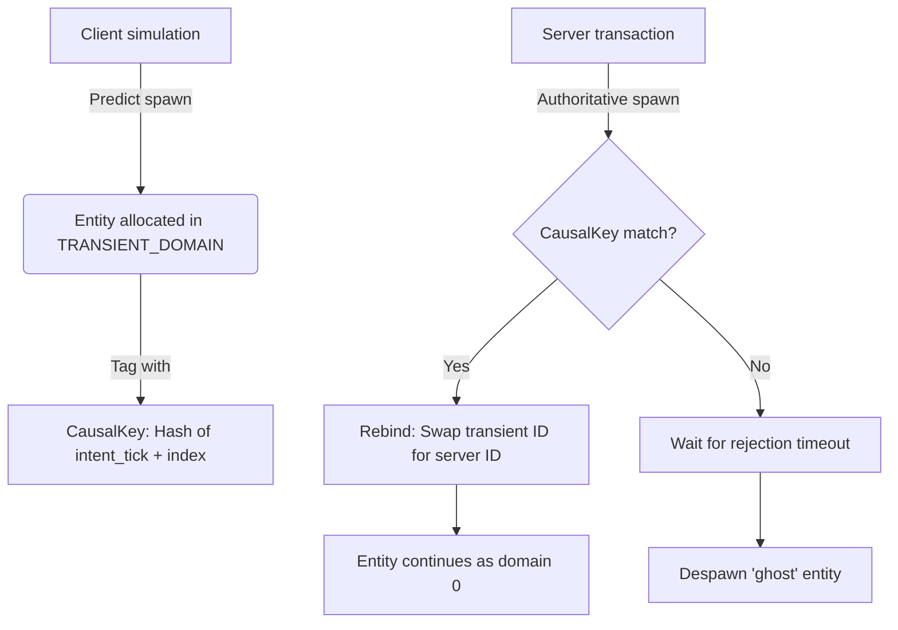
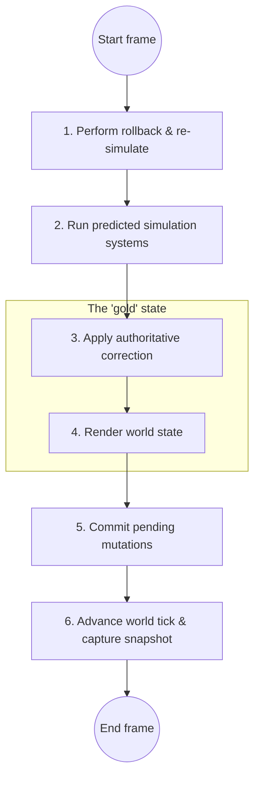

# Netcode Architecture

This is a technical guide to how Glom handles networking and replication. It's meant to orient users on the core networking concepts and to help library maintainers understand the goals of Glom.

## Design Philosophy: Composable Netcode

Glom doesn't aim to provide a "one-size-fits-all" networking solution. Instead, it gives you a library of **composable building blocks** that you can mix and match to support different network topologies and latency-mitigation strategies.

We've designed most of these primitives to be **ECS-native**. Concepts like user inputs are modeled as standard components and systems so they benefit from the same performance and ergonomics as the rest of your game logic. 

That said, we've also "hoisted" certain utilities out of the ECS proper. For example, our **fixed timestep** logic is a standalone utility because tools like that are often useful even for parts of your application that don't live inside the ECS.

While we've provided pre-defined system groups for common patterns, you're encouraged to extend these components to fit your simulation's specific needs. If your ideal strategy isn't possible with Glom's primitives yet, we'd love to hear about it in our Discord or a GitHub issue/PR!

## 1. Multi-Topology Support

Glom's primitives are tested with **Server-Authoritative** and **Distributed P2P (Multi-Master)** topologies in mind but are flexible enough to support other models too.

### Server-Authoritative
- **Downstream (Server -> Client)**: The server broadcasts authoritative state changes using `Transaction` operations.
- **Upstream (Client -> Server)**: Clients send high-level  **Commands** (not raw ECS mutations) which the server validates before applying them to the authoritative world state.

### Distributed P2P (Multi-Master)
- Agents broadcast their local `Transaction` operations to all other peers.
- Conflicts are resolved via **Last-Write-Wins (LWW)** or CRDT-inspired logic based on causal ordering.

## 2. Entity Registry Domains (Provenance Buckets)

Entities in Glom are represented as unsigned 32-bit integers. Generating unique IDs within this numeric space is a common challenge to networked ECS libraries—if every agent uses a simple counter multiple agents might try to spawn "Entity 1" at the same time and cause conflicts.

We solve this without making everyone talk to a central authority by partitioning that 32-bit space into **Domains**. An `entity` ID is split into two parts: `hi` bits for the domain/provenance and `lo` bits for a monotonic counter. Each agent is assigned its own domain ID and you only "own" that one domain, meaning you're the only one who can `spawn` or `despawn` entities in it. When you receive a remote entity you store it in your local registry under its original domain. This keeps IDs stable and globally unique across the whole network without needing additional ID mapping layers.

### Why this matters (An Example)
Imagine a P2P game with two players, Alice and Bob. 
- Alice is assigned **Domain 1**.
- Bob is assigned **Domain 2**.

When Alice spawns a new entity, it gets ID `(1, 1)`. At the exact same moment, Bob spawns one too—but because he's in Domain 2, his entity gets ID `(2, 1)`. 

When they sync up, there's no confusion. Alice's local world now has `(1, 1)` and `(2, 1)`, and Bob's has the exact same pair. Because the "provenance" is baked right into the ID, we get distributed generation for free.

### Why 32-bit ids?

Glom prioritizes performance. Smaller entity IDs are [engine-friendly](https://medium.com/fhinkel/v8-internals-how-small-is-a-small-integer-e0badc18b6da) and more compact to send over the wire. We use a 32-bit ID format:
- **11 bits** for the domain (provenance)
- **21 bits** for the monotonic counter (entity ID)

This means Glom supports up to **2,048 concurrent domains** (e.g., 2k CCU in a P2P setting) and roughly **2 million unique IDs per domain**. Once a domain hits its limit it'll start recycling dead IDs. While this isn't enough for a persistent MMO it's more than enough for most real-time games where you'll rarely have more than ~1 million alive entities per agent at once.

## 3. Transactions & Replication

Replication happens through recording and applying discrete **Transactions**.

### Transaction
A transaction is a bundle of atomic operations from a single domain that must be applied together to guarantee eventual consistency. It includes the domain of the originating agent (`hi`), a monotonic sequence number (`seq`), the global simulation tick when the operations happened (`tick`), and a list of operations like spawn, despawn, set, or remove.

### Last-Write-Wins (LWW)
For component data, we handle conflicts using an LWW strategy. Every update gets a version (usually the `tick`) to decide the "truth" if multiple agents try to change the same thing, or when a server correction overrides a client prediction. The `World` keeps a version for every component on every entity so late-arriving old data doesn't overwrite your newer state.

## 4. Clock Synchronization

Whether you're using server-authoritative or P2P, all clients try to run on the same **global tick**.

### 4.1 The Synchronization Algorithm
Glom uses a lightweight, NTP-inspired algorithm to keep everyone's timelines aligned. The following sequence diagram shows the four-timestamp handshake used to calculate round-trip time and clock offset between agents:



The process begins when Agent A sends a `ClockSync` message to Agent B and notes the transmission time ($t_0$). Agent B then replies with its own current time ($t_1$) and Agent A's original ($t_0$). Once Agent A gets the response at $t_2$, it can calculate the round-trip time ($t_2 - t_0$), estimate the one-way latency ($L = RTT / 2$), and determine the clock offset ($O = t_1 - (t_0 + L)$). After gathering a few samples, usually 8 to 16, we use a median or moving average to filter out jitter and update the `Timestep` module's offset. If there's a big jump, it'll reset the accumulator to prevent a "burst" of catch-up ticks.

### 4.2 Network Topologies

#### Server-authoritative
In this setup the client periodically asks the server for a `ClockSync`. The server acts as a passive responder, replying with its current monotonic time. This results in every client aligning its "synchronized time" to match the server's clock.

#### Distributed P2P (multi-master)
Each agent sends requests to $N$ other peers, usually the ones closest to them. The agent then calculates the average offset from all the peers that responded. This allows the network to converge on a shared average "network time" without needing a central authority.

## 5. Prediction and Reconciliation

Glom supports **continuous predicted simulations** with asynchronous correction.

> **Note**: While the building blocks here (snapshots, rollback, re-simulation) are generic, our current focus and testing are on the **server-authoritative** topology. Using these for P2P is currently **untested**, though there's nothing stopping you from composing these primitives to build P2P reconciliation if you need it.

### 5.1 Snapshot Semantics (Start-of-Tick)
For reconciliation to be deterministic, a snapshot for tick $T$ has to represent the world at the very beginning of the tick, before any systems have run. This lets the reconciliation engine roll back to exactly tick $T$, apply authoritative changes (transactions) for that tick, and re-run simulation logic starting from a corrected baseline.

### 5.2 Optimistic Spawning
Clients can instantly `spawn` entities in their own domain. Since they own it, there's no risk of colliding with someone else's ID. The server or other peers will eventually get the spawn event and catch up.

### 5.3 Async Correction (The Reconciliation Loop)
When a client gets authoritative state that contradicts its prediction, it must reconcile. The diagram below shows how the world 'rewinds' its state to a previous tick where the server update applies, then 'fast-forwards' back to the present by re-simulating the simulation path with the corrected data:



The process involves jumping back to the tick $T$ of the oldest un-applied transaction and applying all the transactions we've buffered for that tick. We then run the simulation schedule for tick $T$, moving forward to $T+1$ and repeating until we're back at the current predicted tick. Along the way, the re-simulation process updates local history snapshots with the new, corrected states so future rollbacks are based on the truth.

## 6. Predictive Shadowing & Deterministic Correlation

When your simulation logic is the same on both client and server, entities are often logically spawned by **Systems** (like an enemy spawner) rather than user-initiated **Commands**. In these cases, although the logic is the "owner" of the entity, Glom uses the heuristic of letting the server define its canonical identity so that all agents eventually converge on the same ID.

### The Challenge of Remote Spawning
A client can't just allocate a permanent ID in a domain it doesn't own (like the Server's). But to keep things responsive and consistent, the client needs to show the results of logic-driven spawns immediately.

### Transient Entities
When a client predicts a spawn it doesn't own, it uses a transient entity. This flowchart shows the lifecycle of such an entity, from its initial local allocation to its eventual rebinding with a server ID or its despawning as a ghost:



We spawn the entity into a reserved **transient domain** (`TRANSIENT_DOMAIN = 2046`) and tag it with a **causal key**. This key has to be derived from the **intent tick** (when the command was first recorded) so it stays deterministic even if the server processes it a few ticks later. When the server's version of the spawn arrives, it'll have the same `CausalKey`, letting the client swap the transient ID for the authoritative server ID while keeping all local component data and relationships intact.

### Handling Mispredictions (The "What Ifs")

In a server-authoritative model, the server is the final authority. Here's how we handle discrepancies:

#### 1. Server rejection (spawn never happens)
If the server decides the spawn was invalid (maybe you were stunned right as you fired):
- **Detection**: We track how long transient entities have been around. If the server's tick passes the transient spawn's tick without a matching key arriving, we call it a **ghost**.
- **Correction**: The client `despawn`s the ghost. Visually, this looks like a projectile "poofing" out of existence.

#### 2. Server mismatch (different entity spawns)
If the server spawns something else (you predicted a fireball, but it was a frostbolt):
- **The key still matches**: Since the key is based on the *event* (tick + index), they'll still link up.
- **State overwrite**: Our `apply_transaction` logic for `spawn` is destructive—it'll overwrite your predicted components with the server's truth. The fireball "turns into" a frostbolt in a single frame.

## 7. Binary Protocol

To keep things fast and save bandwidth, Glom uses a custom binary protocol for all its messaging.

### 7.1 Message Envelope
Every packet starts with a small header containing the message type (`uint8`) and the relevant simulation tick (`uint32`).

### 7.2 Message Types
Glom uses several message types to coordinate state. A **Handshake (0x01)** establishes your identity and assigns your domain ID. **ClockSync (0x02)** handles standard NTP-style alignment. A **Transaction (0x03)** is the main way ECS state is replicated, including spawn, set, and remove/despawn operations. **Commands (0x04)** are upstream messages from client to server containing user intent. Finally, a **Full State Sync (0x05)** is used for late joins or recovering from significant state divergence by sending a full compressed stream of the world.

## 8. Command API

Upstream communication (Client -> Server) uses a **Command API** that turns user intent into discrete events.

### 8.1 Command Components & Entities
Commands are just entities with standard ECS components. This is useful because it allows us to reuse component serializers since we use the same encoding logic for commands as we do for state. It also enables relational targeting by using a `CommandOf` relationship to link commands to their targets like your player.

### 8.2 Temporal Command Buffer
The world has a `command_buffer` to store intent across ticks. This tick-indexed buffer manages commands before they're spawned as entities. Commands are buffered locally for prediction and then sent to the server for validation.

## 9. Orchestration & Schedules

Glom works best when you add its networking systems directly to your schedules.

### 9.1 System Groups
Glom provides several pre-defined system groups. **Reconciliation (`GlomNetwork.reconcile`)** handles applying remote transactions and performing rollbacks. **Command lifecycle (`GlomNetwork.commands`)** manages spawning and cleaning up ephemeral command entities. Finally, **replication (`GlomNetwork.replicate`)** packages changes into transactions and prunes old history.

### 9.2 Client orchestration order
The flowchart below maps out the sequence of reconciliation, simulation, and rendering that ensures the most authoritative state is displayed each frame. Follow this order in your client's main loop:



The cycle begins by fixing the past with a rollback before starting this frame's simulation. We then predict the state for the *next* frame and apply the server's update for the **current** tick. This ensures what you render is as authoritative as possible and prevents prediction flicker. Finally, we record local changes and grab a snapshot for the next frame.

### 9.3 Client Schedule Example
The following snippet demonstrates how to organize your systems using the pre-defined `GlomNetwork` groups:

```typescript
import * as g from "glom-ecs";

// 1. Define your core simulation systems in a separate schedule.
// This schedule will be used for BOTH normal prediction and re-simulation during rollback.
const simulation = g.make_system_schedule();
g.add_system(simulation, g.GlomNetwork.commands.spawn_ephemeral_commands);
g.add_system(simulation, movement_system);
g.add_system(simulation, g.GlomNetwork.commands.cleanup_ephemeral_commands);

// 2. Build your main client schedule using the orchestration order.
const client = g.make_system_schedule();

// 3. Configure replication
g.add_resource(world, g.ReplicationConfig({
  simulation_schedule: simulation,
  history_window: 64,
  ghost_cleanup_window: 60,
}));

// Phase A: Reconciliation (Fix the past)
g.add_system(client, g.GlomNetwork.reconcile.perform_rollback);
g.add_system(client, g.GlomNetwork.reconcile.cleanup_ghosts);

// Phase B: Prediction (Simulate the future)
g.add_system(client, g.GlomNetwork.commands.spawn_ephemeral_commands);
g.add_system(client, movement_system);

// Phase C: Correction & Rendering (The "Gold" State)
g.add_system(client, g.GlomNetwork.reconcile.apply_remote_transactions);
g.add_system(client, render_system);

// Phase D: Maintenance (Prepare for the next frame)
g.add_system(client, g.GlomNetwork.commands.cleanup_ephemeral_commands);
g.add_system(client, g.GlomNetwork.replicate.commit_pending_mutations);
g.add_system(client, g.GlomNetwork.replicate.advance_world_tick);
g.add_system(client, g.GlomNetwork.replicate.prune_temporal_buffers);
```

## 10. Selective Replication (The `Replicated` Tag)

You can control exactly what gets synced using the `Replicated` tag. The replication group only tracks mutations for entities that have it.
