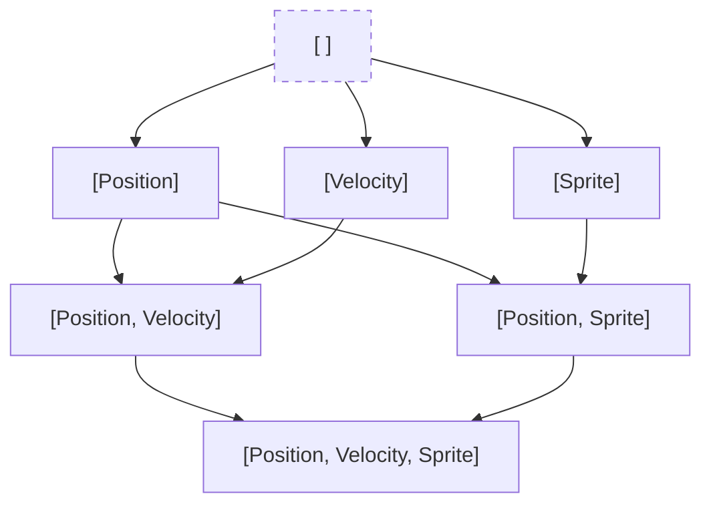

# Entity Graph and Archetypes

The `EntityGraph` is the core data structure in Glom ECS for organizing and storing entities. It uses an **archetype-based** approach where entities with the exact same set of components are grouped together in "nodes".

## Archetypes and the "Vec"

In Glom ECS, an Archetype is defined by a unique combination of component types. This combination is represented by a `Vec` (Vector), which is an ordered list of component IDs. This ordering ensures that the same set of components always results in the same `Vec` and the same hash. Each unique `Vec` maps to exactly one `EntityGraphNode`, and all entities that possess exactly the components in that `Vec` are stored within that node.

## Graph Structure: Subset and Superset Links

The graph is not just a flat map of archetypes; it is a Directed Acyclic Graph (DAG) organized by component inclusion. Cycles are logically impossible because relationships are defined by set inclusion, meaning a node can only link to another as a specialization (adding components) or a generalization (removing components). Any path in the graph represents a monotonic increase or decrease in the number of components, making it impossible to return to a previous set of components by only adding more. Unlike a simple tree, the graph allows for multiple paths to the same node, forming a diamond-like lattice. A node is considered a subset of another if all its components are present in the other node's `Vec`, while a superset is a node that contains all components of the other node plus at least one more.

### Linking Logic

When a new node is inserted, it is linked to its maximal subsets, which are the most specific archetypes contained within it. More general archetypes then link to it as a superset. This structure allows the ECS to efficiently navigate the relationships between different entity types.

## Graph Traversal

The graph can be traversed in two directions. Moving "right" follows links to increasingly specific archetypes by adding components, while moving "left" follows links to increasingly general archetypes by removing components.

## Entity Storage

Each `EntityGraphNode` maintains a `SparseSet` of entities currently belonging to that archetype. When a component is added to or removed from an entity, the entity is fast-migrated from its current node to a new node representing its updated archetype. Systems and queries can find matching entities by identifying the relevant nodes in the graph and traversing their subsets or supersets, avoiding the need to iterate over every entity in the world.

## Why use a Graph for Queries?

The primary advantage of organizing archetypes into a graph is the shift from polling-based to event-based entity resolution. Instead of checking every entity when it is spawned or when its components change, queries and systems can attach listeners to specific nodes in the graph. When an entity moves from one archetype to another, only the affected nodes and their immediate neighbors in the graph need to trigger events. This localized approach eliminates the need to iterate through all entities or archetypes, as a query can anchor itself to a specific node and automatically receive updates for all specialized versions of that node. Listeners only receive notifications when an entity enters or leaves the part of the graph they care about, making the system significantly more performant in complex worlds.

## Performance Benefits

The grouping of entities of the same type improves cache locality, and the graph structure enables efficient event emission. This makes it easy to track which systems need to be notified when entities enter or leave an archetype's scope, such as when a query starts or stops matching an entity.

