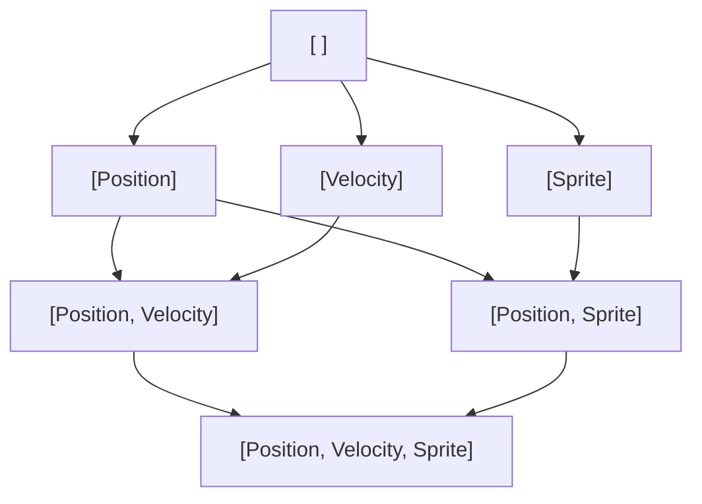

# Entity Graph

The `EntityGraph` organizes entities based on their components. It uses an archetype-based approach, grouping entities with the same set of components into nodes.

## Archetypes

An archetype is a unique combination of component types. It's represented as a `Vec`, which is an ordered list of component IDs. Each unique `Vec` maps to one graph node.

## Graph Structure

The entity graph is directed and acyclic. Nodes are linked based on component inclusion. The entity moves towards a more specialized node with more components when you add a component to it. Conversely, removing a component moves the entity toward a more generalized node with fewer components.

## Entity Storage

Each node stores a set of entities. The entity is migrated from its current node to the new node when a component is added or removed.

## Queries

The graph allows for event-based entity resolution. Queries subscribe to specific nodes instead of checking every entity. The query is updated when an entity enters or leaves a part of the graph that matches it.
