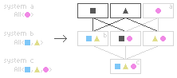
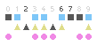

# Getting Started

This guide explains how to set up Glom and the reasoning behind its core patterns.

## Installation

Install the core ECS package first:

```bash
bun add @glom/ecs
```

You'll also need the corresponding plugin for your bundler if you plan on using the build-time transformer:

```bash
# if using Bun
bun add -d @glom/transformer-bun

# if using Vite / Rollup
bun add -d @glom/transformer-rollup
```

## 1. Setting up the Transformer (Optional)

Glom includes a build-time transformer. It is used to inline query loops and determine system dependencies before your code runs.

The transformer rewrites standard JavaScript generators into fast while loops and infers system dependencies based on parameter types.

### For Bun

Register the `glomBunPlugin` in your build configuration to use the transformer with Bun.

```typescript
import { glomBunPlugin } from "@glom/transformer-bun"

Bun.build({
  entrypoints: ["./src/index.ts"],
  outdir: "./dist",
  plugins: [glomBunPlugin()],
})
```

### For Vite / Rollup

Add the `glomRollupPlugin` to your plugins list to use the transformer with Vite or Rollup.

```typescript
// vite.config.ts
import { defineConfig } from "vite"
import { glomRollupPlugin } from "@glom/transformer-rollup"

default defineConfig({
  plugins: [glomRollupPlugin()],
})
```

## 2. ECS 101

This section briefly describes the building blocks of an Entity-Component System.

Entities are simple integer IDs that serve as labels to group data together. They don't contain any logic or data themselves; instead, they act as a pointer to a set of component instances. A component instance is a plain value that represents a specific aspect of an entity, such as its position, health, or a player tag.

The logic of your application is contained within systems, which are functions that operate on entities matching specific component criteria. A movement system might update the position of every entity that has both a position and a velocity component, for example. All of these entities and components are managed by the world, the central container that your systems run logic against.

When a system runs, its queries resolve which nodes in the [Entity Graph](./entity_graph.md) match the required components:



The query then identifies the entities stored at those nodes and fetches their component data for processing.



## 3. Defining Components

Components represent your game's state. In Glom, component instances can be any JavaScript data type. They work naturally with other libraries because they're just plain values without the need for wrappers or extra data copying.

Each entity can have only one instance of a specific component type at a time. An entity can't have two `Position` components, for example.

<aside>
You can achieve something close to entities with multiple components with [relationships](./relationships).
</aside>

`define_component` creates a component that represents a value.

Define a component that holds data, which you'll use to type-safely access and modify state in your systems.

```typescript
import { define_component, define_tag } from "@glom/ecs"

const Position = define_component<{ x: number; y: number }>()
const Velocity = define_component<{ dx: number; dy: number }>()
```

`define_tag` defines a tag component, or a marker that doesn't hold any data.

```typescript
const IsPlayer = define_tag()
```

## 4. Setting up the World

The `World` is the container for all the entities and components in a simulation. You'll need to provide a domain ID and a schema when you create one.

The domain ID is an integer that helps Glom manage entity creation in networked environments. Everyone can spawn entities at the same time without their IDs colliding by giving each peer their own ID. You can just set this to `0` if you're building a single-player game.

The schema is a list of the components you plan to use. Glom needs this to pre-allocate storage for those components and to ensure they're identified the same way across different worlds.

Create a world by calling `make_world` with a unique ID and an array of components it should understand.

```typescript
import { make_world } from "@glom/ecs"

const schema = [Position, Velocity, IsPlayer]
const world = make_world(0, schema) // 0 is the domain ID
```

## 5. Writing Systems (with Transformer)

Systems are where you implement your logic. They are functions that receive entity queries as parameters. Declaring dependencies like `Read<Position>` allows the scheduler to determine execution order.

Most systems are functions that request a query and iterate over the results.

```typescript
import { All, Read, Write } from "@glom/ecs"

const movement_system = (
  query: All<Write<typeof Position>, Read<typeof Velocity>>
) => {
  for (const [pos, vel] of query) {
    pos.x += vel.dx
    pos.y += vel.dy
  }
}
```

## 6. Scheduling and Running

Systems are organized into a `SystemSchedule`.

The schedule uses the read and write requirements of each system to determine their execution order. Systems that write to a component are sorted to run before systems that read from the same component.

Import `make_system_schedule` and add your systems to it before running the schedule in your main loop to organize your systems.

```typescript
import { add_system, make_system_schedule, run_schedule } from "@glom/ecs"

const schedule = make_system_schedule()
add_system(schedule, movement_system)

// in your main loop
run_schedule(schedule, world)
```

## 7. Spawning Entities

Entities are discrete units, identified by a unique integer.

Entities are integer IDs that associate components. `world_flush_graph_changes` batches component additions and removals into a single pass to update the internal entity graph.

Spawn an entity and attach components using this method; remember to call `world_flush_graph_changes` to make the new entity visible to queries.

```typescript
import { add_component, spawn, world_flush_graph_changes } from "@glom/ecs"

const player = spawn(world)
add_component(world, player, Position, { x: 0, y: 0 })
add_component(world, player, Velocity, { dx: 1, dy: 1 })
add_component(world, player, IsPlayer)

// flush changes so they're available to queries
world_flush_graph_changes(world)
```

## Appendix: Without the Transformer

You can define systems manually if you don't want to use a build step.

Some workflows might not support a build-time transformer. `define_system` lets you provide the same metadata explicitly in your code.

Use the `define_system` helper to manually define a system's metadata without using the transformer.

```typescript
import { All, Read, Write, define_system } from "@glom/ecs"

const movement_system = (query: All<Write<typeof Position>, Read<typeof Velocity>>) => {
  for (const [pos, vel] of query) {
    pos.x += vel.dx
    pos.y += vel.dy
  }
}

// manually define the system metadata
define_system(movement_system, {
  params: [
    { all: [{ write: Position }, { read: Velocity }] }
  ]
})
```
